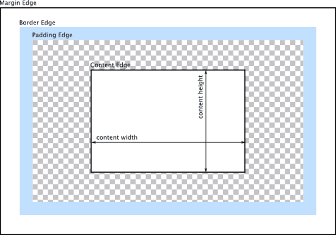

1、W3C的标准Box Model:
```
/*外盒尺寸计算（元素空间尺寸）*/
Element空间高度 = content height + padding + border + margin
Element 空间宽度 = content width + padding + border + margin
/*内盒尺寸计算（元素大小）*/
Element Height = content height + padding + border （Height为内容高度）
Element Width = content width + padding + border （Width为内容宽度）
```
2、IE)传统下Box Model（IE6以下，不含IE6版本或“QuirksMode下IE5.5+”）
```
/*外盒尺寸计算（元素空间尺寸）*/
Element空间高度 = content Height + margin (Height包含了元素内容宽度，边框宽度，内距宽度)
Element空间宽度 = content Width + margin (Width包含了元素内容宽度、边框宽度、内距宽度)
/*内盒尺寸计算（元素大小）*/
Element Height = content Height(Height包含了元素内容宽度，边框宽度，内距宽度)
Element Width = content Width(Width包含了元素内容宽度、边框宽度、内距宽度)
```
## Box-sizing
```
box-sizing ： content-box || border-box || inherit
```
1、content-box:此值为其默认值，其让元素维持W3C的标准Box Model，也就是说元素的宽度/高度（width/height）等于元素边框宽度（border）加上元素内边距（padding）加上元素内容宽度/高度（content width/height）即：Element Width/Height = border+padding+content width/height。

2、border-box:此值让元素维持IE传统的Box Model（IE6以下版本），也就是说元素的宽度/高度等于元素内容的宽度/高度。（从上面Box Model介绍可知，我们这里的content width/height包含了元素的border,padding,内容的width/height【此处的内容宽度/高度=width/height-border-padding】）

## 内容来自
* MDN:[盒模型](https://developer.mozilla.org/zh-CN/docs/Web/CSS/CSS_Box_Model/Introduction_to_the_CSS_box_model)
* w3cplus:[CSS3 Box-sizing](https://www.w3cplus.com/content/css3-box-sizing)
